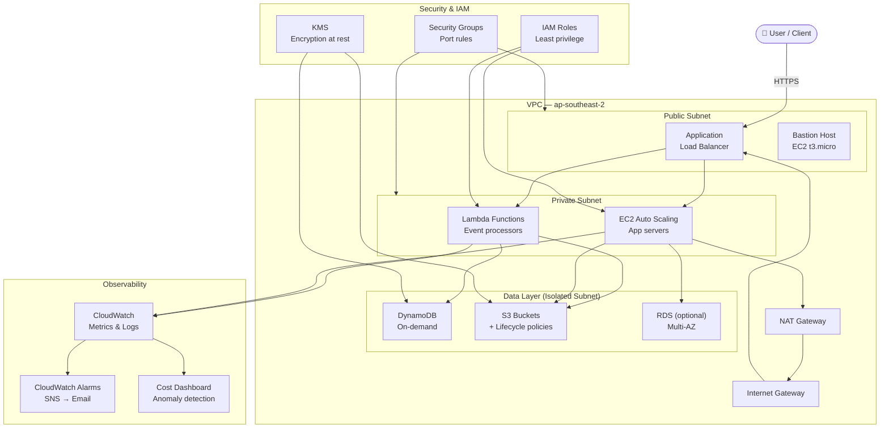
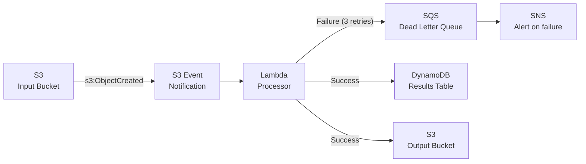

# ☁️ Cloud Architecture Showcase

> Production-ready AWS architecture patterns — serverless pipelines, secure VPC design, and cost-optimised infrastructure as code using AWS CDK (Python).

[](https://docs.aws.amazon.com/cdk/latest/guide/home.html)
[](https://python.org)
[](https://aws.amazon.com/lambda/)
[](LICENSE)
[](https://gurur.me)

---

## Overview

This repository showcases three real-world AWS architecture patterns implemented with Infrastructure as Code (IaC) using the AWS CDK in Python. Each stack is production-grade, follows AWS Well-Architected Framework principles, and includes cost estimates.

**Patterns included:**
1. **Serverless Event Pipeline** — S3 → Lambda → DynamoDB with dead-letter queue handling
2. **Secure VPC with Multi-tier Architecture** — Public/private subnets, NAT gateway, bastion host
3. **CloudWatch Observability Stack** — Dashboards, alarms, and cost anomaly detection

---

## Architecture

### Full AWS Architecture



### Serverless Event Pipeline (Detail)



---

## Quick Start

### Prerequisites

- [AWS CLI](https://aws.amazon.com/cli/) configured with credentials
- Python 3.11+
- Node.js 18+ (required by CDK CLI)
- AWS CDK CLI: `npm install -g aws-cdk`

### 1. Clone and set up

```bash
git clone https://github.com/guppikan/Cloud-architecting.git
cd Cloud-architecting

python -m venv .venv
source .venv/bin/activate          # Windows: .venv\Scripts\activate
pip install -r requirements.txt
```

### 2. Bootstrap your AWS account (first time only)

```bash
cdk bootstrap aws://ACCOUNT-NUMBER/ap-southeast-2
```

### 3. Deploy a stack

```bash
# Preview changes
cdk diff ServerlessPipelineStack

# Deploy
cdk deploy ServerlessPipelineStack

# Deploy all stacks
cdk deploy --all
```

### 4. Tear down

```bash
cdk destroy --all
```

---

## Project Structure

```
Cloud-architecting/
├── app.py                          # CDK app entry point
├── requirements.txt
├── cdk.json
├── stacks/
│   ├── serverless_pipeline.py      # S3 → Lambda → DynamoDB pipeline
│   ├── vpc_stack.py                # VPC, subnets, NAT, security groups
│   └── observability_stack.py      # CloudWatch dashboards, alarms, costs
├── lambda/
│   ├── processor/
│   │   └── handler.py              # Main Lambda handler
│   └── dlq_handler/
│       └── handler.py              # Dead-letter queue reprocessor
├── tests/
│   └── unit/
│       ├── test_serverless.py      # CDK unit tests
│       └── test_vpc.py
├── docs/
│   └── architecture.md             # Detailed architecture decisions
└── README.md
```

---

## Stack Details

### Stack 1 — Serverless Event Pipeline

| Component | Service | Config |
|---|---|---|
| Trigger | S3 Event Notification | `s3:ObjectCreated:*` |
| Compute | Lambda | Python 3.11, 512 MB, 30s timeout |
| Storage | DynamoDB | On-demand (pay-per-request) |
| Error handling | SQS DLQ | 3 retries, then DLQ |
| Alerting | SNS + CloudWatch | Email on DLQ depth > 0 |

```python
# stacks/serverless_pipeline.py (excerpt)
class ServerlessPipelineStack(Stack):
    def __init__(self, scope, id, **kwargs):
        super().__init__(scope, id, **kwargs)

        bucket = s3.Bucket(self, "InputBucket",
            removal_policy=RemovalPolicy.DESTROY,
            lifecycle_rules=[s3.LifecycleRule(
                expiration=Duration.days(90)
            )]
        )

        table = dynamodb.Table(self, "ResultsTable",
            partition_key=dynamodb.Attribute(
                name="id", type=dynamodb.AttributeType.STRING
            ),
            billing_mode=dynamodb.BillingMode.PAY_PER_REQUEST,
            encryption=dynamodb.TableEncryption.AWS_MANAGED
        )
```

### Stack 2 — Secure VPC

| Component | Config |
|---|---|
| VPC CIDR | `10.0.0.0/16` |
| Availability Zones | 2 (ap-southeast-2a, 2b) |
| Public subnets | `/24` — ALB, Bastion |
| Private subnets | `/24` — Lambda, EC2 |
| Isolated subnets | `/24` — DynamoDB, RDS |
| NAT Gateway | 1 per AZ (cost-optimised: 1 shared) |

### Stack 3 — Observability

- CloudWatch Dashboard with Lambda errors, DynamoDB consumed capacity, and S3 object counts
- Alarms for Lambda error rate > 1%, DLQ depth > 0, and estimated charges > $50/month
- Cost anomaly detector with 10% threshold notification

---

## Cost Estimate

For a moderate workload (~100k Lambda invocations/month, ~10 GB DynamoDB storage):

| Service | Monthly Cost (USD) |
|---|---|
| Lambda (100k invocations) | ~$0.20 |
| DynamoDB (10 GB, on-demand) | ~$2.50 |
| S3 (50 GB storage + requests) | ~$1.20 |
| NAT Gateway | ~$4.50 |
| CloudWatch logs | ~$0.50 |
| **Total estimate** | **~$9/month** |

> Costs calculated for `ap-southeast-2` (Sydney). Use the [AWS Pricing Calculator](https://calculator.aws) for your specific workload.

---

## AWS Well-Architected Pillars

| Pillar | Implementation |
|---|---|
| Operational Excellence | CDK IaC, CloudWatch alarms, structured logging |
| Security | IAM least privilege, KMS encryption, private subnets, Security Groups |
| Reliability | DLQ for failed events, multi-AZ VPC, Lambda retries |
| Performance | DynamoDB on-demand, Lambda auto-scaling, S3 lifecycle |
| Cost Optimisation | Pay-per-request DynamoDB, S3 lifecycle expiry, cost anomaly alerts |

---

## Roadmap

- [ ] Add EventBridge for scheduled pipeline triggers
- [ ] Implement Step Functions for multi-step workflows
- [ ] Add WAF to ALB for security hardening
- [ ] Terraform equivalent for portability
- [ ] GitHub Actions pipeline for CDK deployments

---

## Author

**Guru Prasad Raju** · Cloud Automation Engineer · Sydney, AU
[gurur.me](https://gurur.me) · [LinkedIn](https://www.linkedin.com/in/guru-prasad-raju) · [GitHub](https://github.com/guppikan)

---

## License

MIT — see [LICENSE](LICENSE) for details.
